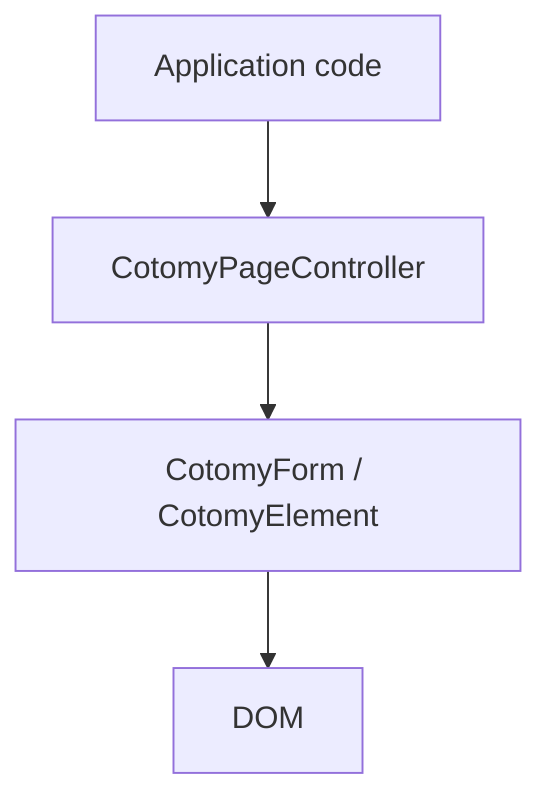

# Architecture

Cotomy is organized as a runtime stack that stays close to the browser instead of replacing it with a component renderer.

## Four Layers

| Layer | Responsibility |
| --- | --- |
| **Application code** | Business rules, page behavior, API decisions, and workflow logic |
| **CotomyPageController** | Coordinates page lifecycle, navigation timing, and page-level orchestration |
| **CotomyForm / CotomyElement** | Encapsulates DOM operations, event registration, form handling, and runtime safety |
| **DOM** | The primary UI state and the visible structure users interact with |

## DOM as Primary State

Cotomy keeps the DOM as the primary UI model.

- Form values live in form controls
- Visibility and structure live in the DOM tree
- Attributes and text content represent the current UI state

This avoids the split between "real UI" and a separate in-memory render model.

## Runtime Lifecycle Tracking

Cotomy adds lifecycle structure around ordinary DOM behavior.

- Event handlers registered through Cotomy are tracked
- Cleanup runs when elements leave the DOM
- DOM moves are handled explicitly so runtime state stays consistent
- Page-level lifecycle can be coordinated without building a large SPA shell

This is especially useful on long-lived business screens where leaks and duplicate handlers accumulate over time.

## Scoped CSS

CotomyElement can attach scoped CSS together with markup.

- Styles stay local to the relevant element tree
- Runtime disposal removes styles when the owning elements are gone
- Screen-level changes remain easier to reason about than global stylesheet conventions

## Why the Stack Matters

The architectural goal is not "more abstraction." It is better boundaries.

- Application code stays focused on business behavior
- Runtime code handles lifecycle, events, and form structure
- The DOM remains inspectable with normal browser tools

## Where to Go Next

- [Overview](/)
- [Use Cases](/use-cases/)
- [Design Philosophy](/design-philosophy/)
- [Reference](/reference/)

