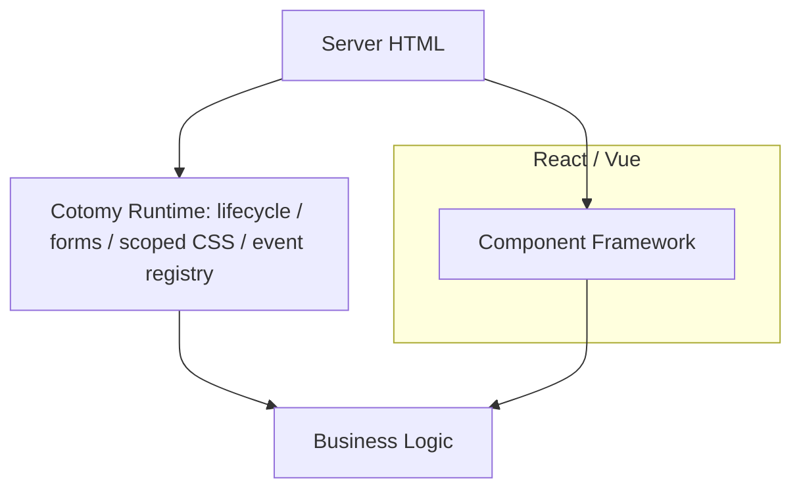

# Comparison

## Cotomy Position

Cotomy is not a component framework.  
It is a DOM-structured runtime layer designed for form-driven, page-scoped business systems.

Cotomy does not replace the platform. It enforces runtime discipline on top of the platform.

## Responsibility Comparison

| Concern | Cotomy | React / Vue | Alpine | jQuery |
| --- | --- | --- | --- | --- |
| UI state location | DOM | JS memory | DOM + JS | DOM |
| Rendering model | Direct DOM | Virtual DOM / reactive | Direct DOM | Direct DOM |
| Form handling | First-class | Library dependent | Manual | Manual |
| Lifecycle safety | Built-in runtime | Hook-based | Manual | Manual |
| CSS scoping | Runtime scoped | Build or convention | None | None |
| Page model | Page-scoped | SPA / Component | Page / Widget | Page |
| Data binding | Renderer-driven | Reactive state | Attribute-based | Manual |
| Event cleanup | Automatic | Component lifecycle | Manual | Manual |

## Philosophy Differences

Cotomy:

- DOM = state
- No virtual render layer
- Form-first
- Page-scoped architecture
- Runtime lifecycle safety

React / Vue:

- JS state = source of truth
- Virtual or reactive render cycle
- Component tree centered
- SPA-oriented architecture

## Where Cotomy Fits

| Fit | Why |
| --- | --- |
| Business systems | Forms and APIs are central |
| Long-lived screens | Runtime safety reduces UI risk |
| Server HTML with dynamic behavior | Works alongside SSR |
| Admin and management tools | Input and process heavy |

## Where Cotomy Does Not Fit

| Not a Fit | Why |
| --- | --- |
| Large-scale SPA | No global state management |
| High-frequency re-render UIs | Not a render-optimization framework |
| Canvas / game UIs | DOM-centric design |

## Why Cotomy Is Not a Framework

Cotomy does not replace the platform.  
It enforces runtime discipline on top of the platform.

Cotomy can coexist with other frameworks when page scope and responsibilities
are clearly separated.

## Summary

Cotomy reduces UI risk, not rendering cost.
