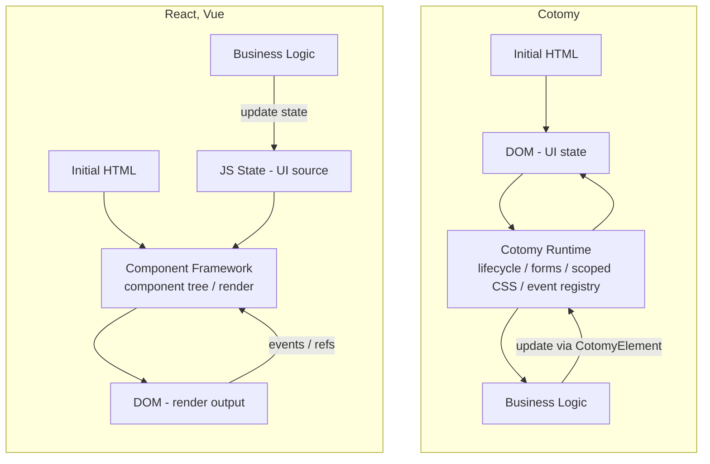

# Comparison

## Cotomy Position

Cotomy is a DOM-oriented runtime layer for form-driven, page-scoped systems.
Unlike component-rendering SPA frameworks, it keeps the DOM as the primary UI model.

```mermaid
flowchart LR
  subgraph Frameworks[ React, Vue ]
    direction TB
    B1["Initial HTML"]
    B2["Component Framework\ncomponent tree / render"]
    B3["JS State - UI source"]
    B4["DOM - render output"]
    B5["Business Logic"]
    B1 --> B2
    B3 --> B2
    B2 --> B4
    B5 -- "update state" --> B3
    B4 -- "events / refs" --> B2
  end

  subgraph Cotomy[ Cotomy ]
    direction TB
    A1["Initial HTML"]
    A2["DOM - UI state"]
    A3["Cotomy Runtime\nlifecycle / forms / scoped CSS / event registry"]
    A4["Business Logic"]
    A1 --> A2 --> A3 --> A4
    A4 -- "update via CotomyElement" --> A3
    A3 --> A2
  end

  Frameworks ~~~ Cotomy
```

The key difference is **where UI state lives** and **what owns the UI model**.
In Cotomy, business logic updates the DOM through runtime APIs so lifecycle and event cleanup stay consistent.

- **Cotomy:** The DOM is the UI state. Cotomy adds a runtime layer for lifecycle,
  forms, scoped CSS, and event cleanup. Updates should go through CotomyElement
  or Cotomy forms so the runtime can track lifecycle and handlers correctly.
- **React/Vue:** UI state lives primarily in JavaScript memory. The framework
  renders that state into the DOM, which becomes the output of the component tree.

“Initial HTML” here simply means the HTML that exists before the client runtime
starts. It could be server-rendered HTML, static HTML, or HTML produced by a build step.

Use Cotomy when you want HTML/DOM to stay central and need runtime safety for forms and screen-level workflows.
Use a component framework when you want a centralized render model and a JS state tree as the source of truth.
For design rationale and practical usage notes, see the [Cotomy Blog](https://blog.cotomy.net/).

## Responsibility Comparison

| Concern | Cotomy | React / Vue | Alpine | jQuery |
| --- | --- | --- | --- | --- |
| UI state location | DOM | JS memory | DOM + JS | DOM |
| Rendering model | Direct DOM | Virtual DOM / reactive | Direct DOM | Direct DOM |
| Form handling | First-class | Library dependent | Manual | Manual |
| Lifecycle safety | Built-in runtime | Hook-based | Manual | Manual |
| CSS scoping | Runtime scoped | Build or convention | None | None |
| Page model | Page-scoped | SPA / Component | Page / Widget | Page |
| Data binding | DOM + runtime-driven | Reactive state | Attribute-based | Manual |
| Event cleanup | Automatic | Component lifecycle | Manual | Manual |

## Philosophy Differences

| Cotomy | React / Vue |
| --- | --- |
| DOM as primary state | JS state as primary source of truth |
| No virtual render layer | Virtual or reactive render cycle |
| Form-first design | Component-tree-first design |
| Page-scoped structure | SPA-oriented structure |
| Runtime lifecycle safety | Lifecycle driven by component hooks |

## Where Cotomy Fits

| Fit | Why |
| --- | --- |
| Business systems | Forms and APIs are central |
| Screen-level workflows | Runtime safety reduces UI risk |
| Server HTML with dynamic behavior | Works alongside SSR |
| Admin and management tools | Input and process heavy |

## Where Cotomy Does Not Fit

| Not a Fit | Why |
| --- | --- |
| Large-scale SPA | No global state management |
| High-frequency re-render UIs | Not a render-optimization framework |
| Highly animated UI | Not optimized for frequent visual re-render cycles |
| Canvas / game UIs | DOM-centric design |

## Why Cotomy Is Not a Component-Rendering SPA Framework

Here, “framework” means a component-rendering SPA framework that owns UI state and render cycles.
Cotomy instead adds structure around browser-native DOM behavior, and can coexist with other frameworks when page boundaries are clear.

## Summary

Cotomy is aimed at reducing UI maintenance risk in DOM-centric business screens, not at render optimization.
