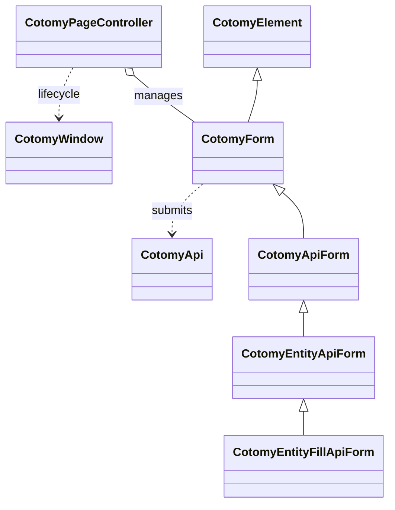

# Getting Started

This guide is a short, practical entry point to Cotomy. Each page builds on the previous one.

## How to Use This Guide

1. Start with Installation.
2. Build a minimal UI with `CotomyElement`.
3. Learn event handling, the DOM-state model, and forms.

## Architecture Map

## Sections

- [Installation](./getting-started/01-installation.md)
- [First UI](./getting-started/02-first-ui.md)
- [Events and State](./getting-started/03-events-and-state.md)
- [Forms Basics](./getting-started/04-forms-basics.md)
- [API Integration](./getting-started/05-api-integration.md)
- [Ajax Form](./getting-started/06-ajax-form.md)
- [Page Control](./getting-started/07-page-control.md)
- [Debugging and Tips](./getting-started/08-debugging-and-tips.md)

## Next

Use the Reference pages for detailed class and method descriptions.
