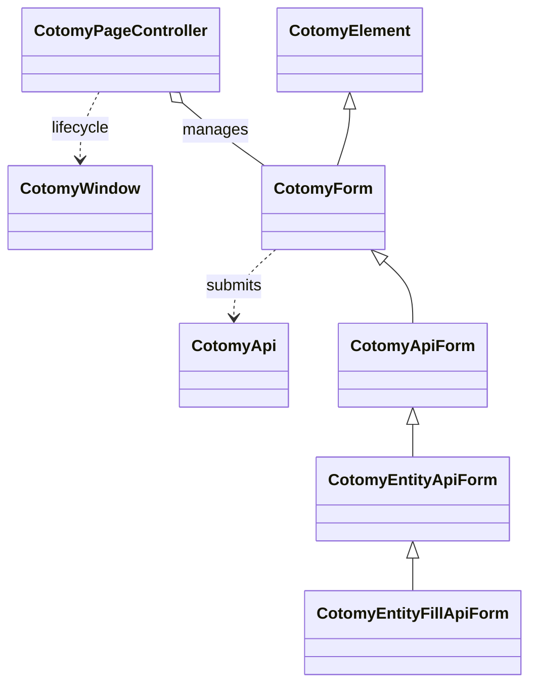

# Getting Started

This guide is a short, practical entry point to Cotomy. Each page builds on the previous one.

## Cotomy's Design Model

Cotomy is a page-oriented UI layer, not an application framework.

Cotomy is designed around page-scoped UI, not a global application state.
Each page should:

- Have its own entry file
- Control only its own DOM
- Avoid hidden cross-page dependencies

> **Note on sharing one entry file across multiple endpoints**
>
> Cotomy’s design model assumes one entry file per page. This keeps lifecycle
> boundaries structural rather than convention-based and is the safest default.
>
> If you intentionally choose to use a single entry file that handles multiple
> pages, treat this as an advanced configuration. From a framework design
> perspective, providing an entry point per page is still **strongly
> recommended**.
>
> When using a shared entry file, you must enforce the same isolation rules in
> your own architecture:
>
> - Do not keep page-specific state in global variables or singletons
> - Do not retain DOM references across page navigations
> - Load page-specific logic conditionally based on URL or DOM context
> - Avoid retaining page-specific state after navigation (treat navigation as disposal)
>
> In this setup, lifecycle safety depends on application design rather than
> Cotomy’s structural model.

This keeps behavior predictable, debugging simple, page reloads safe, and
server-rendered apps easy to integrate. Cotomy intentionally avoids a global
app container or virtual DOM layers. The DOM is the UI state.

Cotomy's model scales by composition of pages, not by growing a single
application shell. Large systems remain maintainable because:

- Each page has a bounded lifecycle
- Memory and event handlers are naturally released on navigation
- No global state container grows over time
- Server-rendered and SPA-style pages can coexist

Cotomy favors predictable behavior and low cognitive load over framework-level
abstractions. If you prefer:

- Direct DOM control
- Minimal runtime abstraction
- Clear lifecycle boundaries
- Compatibility with server-rendered systems

Cotomy fits naturally.

Cotomy is especially effective for systems where:

- Pages are served independently
- Business flows are document-driven
- Server and client responsibilities are clearly separated

Instead of building a large, long-lived client application, you build a set of
predictable page modules.

## How to Use This Guide

1. Start with Installation.
2. Build a minimal UI with `CotomyElement`.
3. Learn event handling, the DOM-state model, and forms.

## Architecture Map

```mermaid
classDiagram
class CotomyWindow
class CotomyPageController
class CotomyElement
class CotomyForm
class CotomyApi
class CotomyApiForm
class CotomyEntityApiForm
class CotomyEntityFillApiForm

CotomyElement <|-- CotomyForm
CotomyForm <|-- CotomyApiForm
CotomyApiForm <|-- CotomyEntityApiForm
CotomyEntityApiForm <|-- CotomyEntityFillApiForm

CotomyForm ..> CotomyApi : submits
CotomyPageController o-- CotomyForm : manages
CotomyPageController ..> CotomyWindow : lifecycle
```

## Sections

- [Installation](./getting-started/01-installation.md)
- [First UI](./getting-started/02-first-ui.md)
- [Events and State](./getting-started/03-events-and-state.md)
- [Forms Basics](./getting-started/04-forms-basics.md)
- [API Integration](./getting-started/05-api-integration.md)
- [Ajax Form](./getting-started/06-ajax-form.md)
- [Page Control](./getting-started/07-page-control.md)
- [Debugging and Tips](./getting-started/08-debugging-and-tips.md)

## Next

Use the Reference pages for detailed class and method descriptions.
