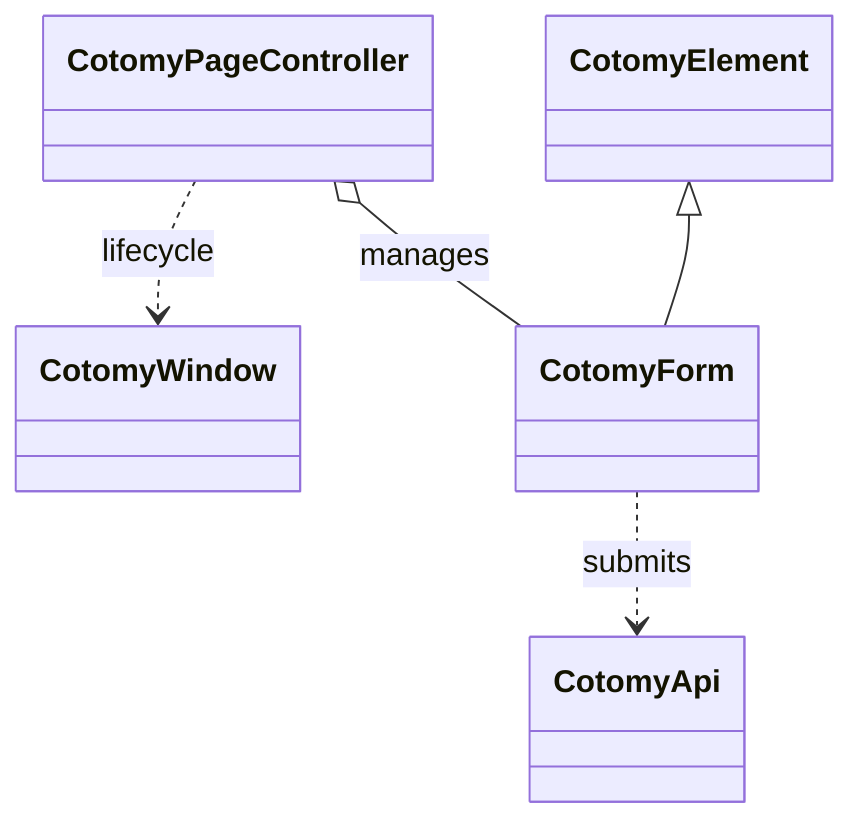

# Installation

This page covers the minimum setup for using Cotomy and the design model it assumes.

Download source code: [Cotomy v0.4.5 ZIP](https://github.com/yshr1920/cotomy/archive/refs/tags/v0.4.5.zip)

## Cotomy's Design Model

Cotomy is a page-oriented UI layer, not an application framework.

Cotomy is designed around page-scoped UI, not a global application state.
Each page should:

- Have its own entry file
- Control only its own DOM
- Avoid hidden cross-page dependencies

This keeps behavior predictable, debugging simple, page reloads safe, and
server-rendered apps easy to integrate. Cotomy intentionally avoids a global
app container or virtual DOM layers. The DOM is the UI state.

Cotomy's model scales by composition of pages, not by growing a single
application shell. Large systems remain maintainable because:

- Each page has a bounded lifecycle
- Memory and event handlers are naturally released on navigation
- No global state container grows over time
- Server-rendered and SPA-style pages can coexist

Cotomy favors predictable behavior and low cognitive load over framework-level
abstractions. If you prefer:

- Direct DOM control
- Minimal runtime abstraction
- Clear lifecycle boundaries
- Compatibility with server-rendered systems

Cotomy fits naturally.

Cotomy is especially effective for systems where:

- Pages are served independently
- Business flows are document-driven
- Server and client responsibilities are clearly separated

Instead of building a large, long-lived client application, you build a set of
predictable page modules.

## Goals

- Add Cotomy to your project
- Define a page-level endpoint
- Understand the one-page, one-entry model
- Confirm a basic build or script load

## Related Classes



## Steps

### 1) Install with npm

```bash
npm install cotomy
```

### 2) Create a page entry

Cotomy works best when each page has its own entry file and endpoint.
This keeps behavior local and avoids hidden cross-page coupling.

Example structure:

```text
src/
	pages/
		users/
			index.ts
			index.html
		settings/
			index.ts
			index.html
```

### 3) Configure per-page endpoints

Expose one endpoint per page and map it to the matching entry file.
How you do this depends on your stack, but the intent is the same:

- `/users` -> `src/pages/users/index.ts`
- `/settings` -> `src/pages/settings/index.ts`

In server-rendered apps, this typically means a route that renders the HTML
and loads the corresponding script bundle for that page.

### Why one entry per page?

Cotomy assumes a document-oriented UI model:

| SPA Model | Cotomy Model |
| --- | --- |
| Global app root | Independent page modules |
| Virtual state | DOM = state |
| Long-lived app | Page lifecycle |

This keeps behavior isolated and avoids cross-page memory leaks.

### 3a) Example webpack setup

If you bundle per page with webpack, define a multi-entry config and output
to a page-specific bundle name.

Bundling per page is recommended for larger apps, but not required.
Smaller setups can load Cotomy with a single script.

```js
// webpack.config.cjs
const path = require("path");

module.exports = {
	mode: "development",
	entry: {
		users: "./src/pages/users/index.ts",
		settings: "./src/pages/settings/index.ts",
	},
	output: {
		path: path.resolve(__dirname, "dist"),
		filename: "[name].bundle.js",
	},
	resolve: {
		extensions: [".ts", ".js"],
	},
	module: {
		rules: [
			{
				test: /\.ts$/,
				use: "ts-loader",
				exclude: /node_modules/,
			},
		],
	},
};
```

Then reference the page bundle in each HTML file:

```html
<script src="/dist/users.bundle.js"></script>
```

```html
<script src="/dist/settings.bundle.js"></script>
```

### 3b) Example Vite setup (optional)

If you prefer Vite, use a multi-page build config:

```ts
// vite.config.ts
import { defineConfig } from "vite";
import { resolve } from "path";

export default defineConfig({
	build: {
		rollupOptions: {
			input: {
				users: resolve(__dirname, "src/pages/users/index.html"),
				settings: resolve(__dirname, "src/pages/settings/index.html"),
			},
		},
	},
});
```

### 4) Import Cotomy

```ts
import { CotomyElement } from "cotomy";
```

### 5) Create your first Cotomy element

```ts
import { CotomyElement } from "cotomy";

new CotomyElement({
	html: `<div class="hello">Hello Cotomy</div>`,
	css: `[root].hello { color: green; font-weight: bold; }`,
}).appendTo(new CotomyElement(document.body));
```

### 6) Verify the page

Open the page and confirm there are no console errors.

- [ ] Add the Cotomy package dependency
- [ ] Import Cotomy in your entry file
- [ ] Render a minimal Cotomy element
- [ ] Verify the page loads without errors

## Next

Next: [First UI](./02-first-ui.md) to create your first DOM-backed element.
