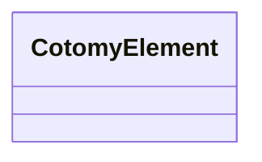

# First UI

Create and attach your first CotomyElement.

This step shows the smallest meaningful unit in Cotomy: a DOM-backed UI element
with scoped styling.

## Goals

- Create a UI element from HTML
- Apply scoped CSS
- Attach it to an existing DOM node
- Understand that the DOM element is the UI state

## Related Classes



## Steps

### 1) Create a CotomyElement

```ts
import { CotomyElement } from "cotomy";

const card = new CotomyElement({
	html: `<div class="card">Hello Cotomy</div>`,
	css: `
		[root].card {
			padding: 16px;
			background: #e8f5e9;
			border-radius: 6px;
		}
	`,
});
```

The HTML must have a single root element. Multiple roots will throw an error.  
CotomyElement creates a real DOM element, so what you inspect is what runs.  
CSS is scoped at runtime to avoid leakage into other parts of the page.  
Selectors are treated as relative to the root element. To target the root
element itself, use the [root] selector.

You can style child elements in two ways:

```ts
css: `
	.title { font-weight: 600; }
	.icon { width: 16px; }
`
```

This targets children under the root. It does **not** style the root itself.
Use [root] when the selector should include the root element:

```ts
css: `
	[root] .title { font-weight: 600; }
	[root].active .icon { opacity: 1; }
`
```

[root] is useful when you need to combine root state (like .active) with
descendant styling.

### 2) Attach it to the page

```ts
const body = new CotomyElement(document.body);
card.appendTo(body);
```

This moves the element into the document. From this point, it participates in
layout and events like any normal DOM node.

### 3) Modify the UI directly

```ts
card.text = "Updated text";
card.style("color", "green");
```

You update the UI by updating the DOM directly.

### 4) Add another element

```ts
card.append({
	html: `<button class="btn">Click</button>`,
	css: `[root].btn { margin-top: 8px; }`,
});
```

## Important Concept: DOM = UI State

Cotomy does not mirror UI state into a separate store. Changing text,
attributes, styles, or children updates the UI state directly.

## What just happened?

You:

1. Created a DOM element
2. Applied scoped styles
3. Attached it to the page
4. Updated it directly

This is the core workflow.

### Cotomy is not doing:

- Virtual DOM diffing
- Component re-render cycles
- Global state synchronization

Everything you see is the real DOM.

## Next

Next: [Events and State](./03-events-and-state.md) to wire up interactions.
