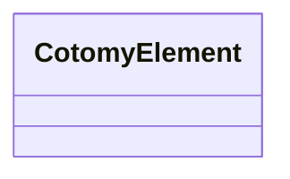

# Events and State

In Cotomy, events are standard DOM events managed through runtime tracking.
This section shows how interaction works with the DOM as UI state.

## Goals

- Register and remove events safely
- Understand Cotomy's event delegation model
- See how DOM changes represent state

## Related Classes



## Steps

These steps assume you still have the card element from the First UI page.

### 1) Add a click event

```ts
new CotomyElement(`<button class="btn">Click me</button>`).appendTo(card).on("click", () => {
	console.log("Button clicked");
});
```

Cotomy uses native DOM events. on() registers handlers through Cotomy's
internal registry to avoid leaks.

Handlers are tracked per element instance to prevent duplicate bindings and keep cleanup safe.

on() attaches directly to the element. onSubTree() listens once on the root and delegates to matching children.

### 2) Use event delegation

```ts
card.onSubTree("click", ".btn", () => {
	console.log("Button inside card clicked");
});
```

onSubTree() listens once on the root element and delegates to matching
children. This also works for elements added later with append().

This avoids rebinding when the DOM changes dynamically.

### 3) Modify the UI as state

```ts
card.onSubTree("click", ".btn", () => {
	card.text = "Clicked!";
});
```

There is no separate state store. Changing the DOM updates the UI state
directly.

### 4) Event cleanup is automatic

When an element is removed, handlers registered with on()/onSubTree()/once()
are cleared automatically. Handlers are tracked per element instance.

Shortcut helpers like click() attach native listeners and are not tracked by
the registry.

## Important Concept: Events Follow the DOM Lifecycle

Handlers are tied to the element instance. When the element leaves the
document, its registrations are cleared, preventing stale listeners.

### Cotomy does not:

- Wrap events in a synthetic event system
- Re-dispatch events through a global bus
- Require manual unbinding in normal page flows

## What just happened?

You:

1. Registered DOM events
2. Used delegated handling
3. Changed the UI directly
4. Let Cotomy manage handler lifecycle

This is how Cotomy keeps interaction simple and predictable.

## Next

Next: [Forms Basics](./04-forms-basics.md) to structure submissions.
