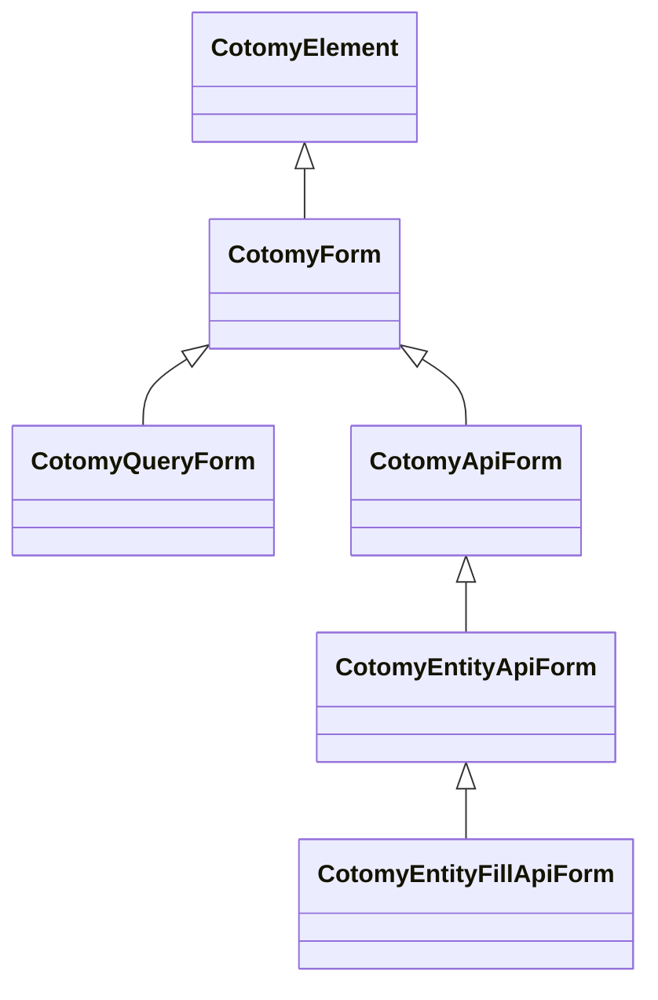

# Forms Basics

Forms in Cotomy are structured UI units built on the same DOM-state model.
`CotomyForm` adds a predictable submission flow on top of `CotomyElement`.

Forms are screen-level processing units, not UI components.

## Form Types at a Glance

| Form Type | Base | Purpose | Notes |
| --- | --- | --- | --- |
| `CotomyForm` | `CotomyElement` | Standard submit lifecycle | Use when you want full control of `submitAsync()` |
| `CotomyQueryForm` | `CotomyForm` | Query navigation via GET | Builds a query string from inputs and navigates |
| `CotomyApiForm` | `CotomyForm` | API submit with `FormData` | Handles `FormData` and API error events |
| `CotomyEntityApiForm` | `CotomyApiForm` | Entity-aware API submit | Switches POST to PUT when an entity key exists |
| `CotomyEntityFillApiForm` | `CotomyEntityApiForm` | Load and fill inputs | Fetches data and fills inputs on load and submit |

## Goals

- Define a form using `CotomyForm`
- Understand Cotomy's submit lifecycle
- See how form elements remain DOM-based

## Related Classes



## Steps

### 1) Create a form element

```ts
import { CotomyElement, CotomyForm } from "cotomy";

class SimpleForm extends CotomyForm {
	public async submitAsync(): Promise<void> {
		console.log("Form submitted");
	}
}

const form = new SimpleForm(`
	<form>
		<input name="name" />
		<button type="submit">Send</button>
	</form>
`);

form.appendTo(new CotomyElement(document.body));
```

The root element must be a `<form>` element. `CotomyForm` does not create one
for you.

### 1a) Recommended: bind existing HTML

Cotomy typically works with static or server-rendered HTML, then binds behavior
to the existing form using `byId()`.

```html
<form id="profile-form">
	<input name="name" />
	<button type="submit">Save</button>
</form>
```

```ts
import { CotomyForm } from "cotomy";

class ProfileForm extends CotomyForm {
	public async submitAsync(): Promise<void> {
		console.log("Profile submitted");
	}
}

const form = CotomyForm.byId<ProfileForm>("profile-form", ProfileForm);
form?.initialize();
```

### 2) Initialize the form

```ts
form.initialize();
```

`initialize()` sets up Cotomy's internal submit handling.
It must be called once to enable Cotomy's submit lifecycle.

### 3) Understand the submit flow

When the form is submitted:

1. Default browser submit is prevented
2. Cotomy calls `submitAsync()`
3. You control what happens next

### 4) Access form values

```ts
const nameInput = form.first(`input[name="name"]`);
console.log(nameInput?.value);
```

The state still lives in the DOM.

## Important Concept: Forms are Still DOM

Cotomy does not create a separate form model. Inputs, values, and validation
remain tied to the DOM. `CotomyForm` only standardizes the submission
lifecycle.

Cotomy avoids model binding to keep state observable and prevent hidden sync
logic from creeping into long-lived screens.
Form state is not mirrored in JavaScript objects, so there is no hidden sync
layer.

Form submission logic is centralized, but field state remains local to each
input.

### CotomyForm does not:

- Add a global form state store
- Auto-bind inputs to JS objects
- Replace native form behavior entirely

## What just happened?

You:

1. Created a form element
2. Attached it to the DOM
3. Registered Cotomy's submit lifecycle
4. Handled submission in code

This pattern scales to API and entity forms.

## Next

Next: [API Client Basics](./05-api-integration.md) to call APIs without forms.
