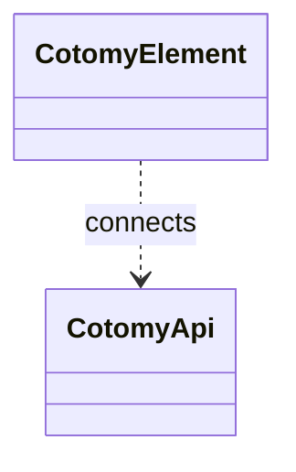

# API Client Basics

`CotomyApi` represents Cotomy's API layer. It does not interact with
the UI unless you explicitly connect it.

This separation keeps UI updates explicit and avoids hidden client state.

Cotomy provides an API client that can be used independently of forms.
Use this when you need to:

- Load data when a page starts
- Trigger actions from buttons or UI elements
- Fetch reference data for UI components

## When to Use CotomyApi

Use `CotomyApi` whenever the page needs to communicate with the server outside
of a form submission. Typical cases:

- Loading initial page data
- Fetching reference lists (select options, lookup data)
- Executing button-triggered actions
- Background saves or state updates
- Periodic or manual refresh operations

## Goals

- Send API requests without a form
- Handle responses and errors
- Understand `CotomyApi`'s role

## Related Classes



## Steps

### 1) Create an API client

```ts
import { CotomyApi, CotomyElement } from "cotomy";

const api = new CotomyApi();
```

### 2) Send a GET request

```ts
const response = await api.getAsync("/api/profile");

if (response.ok && response.available) {
	const data = await response.objectAsync();
	console.log(data);
}
```

### 3) Send POST or PUT

```ts
const formData = new FormData();
formData.set("name", "Alice");

const response = await api.submitAsync({
	method: "post",
	action: "/api/profile",
	body: formData,
});
```

## About FormData

`CotomyApi` accepts a standard `FormData` object as the request body. You can
include text fields, numbers (as strings), files (`File` or `Blob`), and
multiple values for the same key.

```ts
const fileInput = CotomyElement.first(`input[type="file"]`)!;

const data = new FormData();
data.set("name", "Alice");
data.set("age", "30");
data.append("photo", fileInput.element.files?.[0]!);
```

**Cotomy does not modify `FormData`. It sends it as-is.**

You can also pass a plain object (`Record<string, string | number>`) and
Cotomy will convert it to `FormData` when using `multipart/form-data`.

```ts
const data = {
	name: "Alice",
	age: 30,
};

await api.submitAsync({
	method: "post",
	action: "/api/profile",
	body: data,
});
```

Object values are converted to strings when building `FormData`.

### 4) Handle errors

`CotomyApi` throws exceptions for HTTP errors. Handle them with `try/catch`.

```ts
try {
	await api.getAsync("/api/profile");
} catch (e) {
	console.error("API error", e);
}
```

### 5) Use API with UI events

```ts
const statsElement = CotomyElement.first(".stats")!;
const button = CotomyElement.first(".refresh-btn")!;

button.on("click", async () => {
	const response = await api.getAsync("/api/stats");
	const stats = await response.objectAsync();
	statsElement.text = stats.count.toString();
});
```

You manually update the DOM with the result. Cotomy does not auto-bind API data
to the UI.

## Important Concept: API and UI Are Separate Layers

Cotomy keeps API communication separate from UI state.

- `CotomyApi` handles HTTP
- `CotomyElement` manages UI
- You connect them explicitly

### CotomyApi does not:

- Automatically update UI
- Manage application state
- Cache responses globally

CotomyApi does not retain request or response state. Each call is independent.
This keeps long-lived systems predictable and easier to maintain.

Each API call is stateless from the client perspective.

CotomyApi does not introduce a client-side data store.

## Note: Rendering API Responses

`CotomyApi` only handles HTTP communication. If you want to apply server
responses to the UI automatically, use a form-based approach with
`CotomyViewRenderer`. This is covered in the Ajax Form section.

`CotomyViewRenderer` applies response JSON to elements marked with
`data-cotomy-bind`, and you can choose a bind name style with
`CotomyBracketBindNameGenerator` or `CotomyDotBindNameGenerator`.
See [CotomyViewRendererの詳細](../classes/api/cotomy-view-renderer.md),
[CotomyBracketBindNameGeneratorの詳細](../classes/api/cotomy-bracket-bind-name-generator.md), and
[CotomyDotBindNameGeneratorの詳細](../classes/api/cotomy-dot-bind-name-generator.md).

## What just happened?

You:

1. Created an API client
2. Sent requests
3. Processed responses
4. Connected results to the UI

## Next

Next: [Ajax Form](./06-ajax-form.md) to combine forms and API requests.
