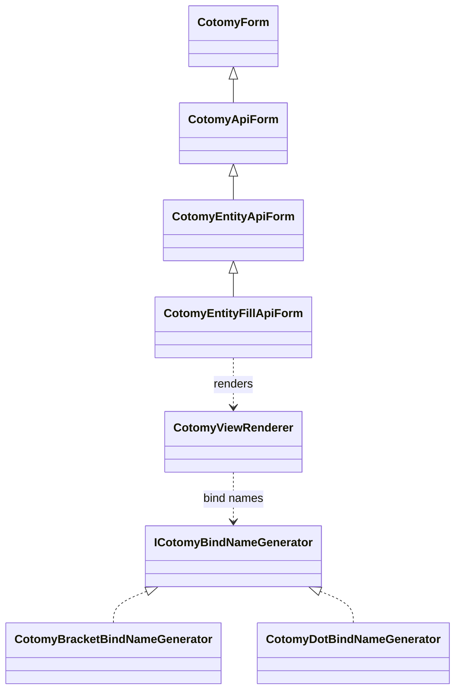

# Ajax Form

Ajax Forms combine form submission, API communication, and automatic response
rendering. They allow you to submit without page reload, load entity data into
inputs, and apply API responses directly to the UI.

This is the complete Cotomy UI pattern: UI + Events + Forms + API + Rendering.

## Goals

- Submit without page reload
- Handle POST to PUT transitions
- Render API responses into the DOM

## Related Classes



## Steps

### Classes used in this pattern

| Class | Role |
| --- | --- |
| `CotomyApiForm` | API submit lifecycle |
| `CotomyEntityApiForm` | POST to PUT transitions using an entity key |
| `CotomyEntityFillApiForm` | Apply API responses to the UI |

### Form capabilities

| Form | API submit | Entity key | Renderer | Auto fill | Notes |
| --- | --- | --- | --- | --- | --- |
| `CotomyForm` | No | No | No | No | Submit lifecycle only |
| `CotomyQueryForm` | No | No | No | No | GET query navigation |
| `CotomyApiForm` | Yes | No | No | No | Sends `FormData` to API |
| `CotomyEntityApiForm` | Yes | Yes | No | No | POST to PUT by entity key |
| `CotomyEntityFillApiForm` | Yes | Yes | Yes | Yes | Loads and fills from API responses |

### 1) Prepare HTML

```html
<form id="profile-form" action="/api/profile" method="post">
	<input name="name" />
	<input name="email" />
	<button type="submit">Save</button>

	<div class="result">
		<span data-cotomy-bind="name"></span>
		<span data-cotomy-bind="email" data-cotomy-bindtype="mail"></span>
	</div>
</form>
```

Inputs are for submission. Elements with `data-cotomy-bind` are for display.
The same data flows into both.

### 2) Bind the form to Cotomy

```ts
import { CotomyEntityFillApiForm } from "cotomy";

const form = CotomyEntityFillApiForm.byId(
	"profile-form",
	CotomyEntityFillApiForm
)!;

form.initialize();
```

`CotomyEntityFillApiForm` submits with `FormData` and applies successful API
responses to elements with `data-cotomy-bind`.

`initialize()` must be called once to enable Cotomy's submit lifecycle.

If the form already has an entity key, it automatically loads data when the
page becomes ready.

### 3) Submit flow

When submitted:

1. `FormData` is created
2. The API request is sent
3. If `201 Created`, the entity key is stored
4. Response JSON is applied to the DOM

This is a server-driven UI update model: the response is the source of truth.
Server responses drive UI state changes, not client-side prediction.

### 4) POST to PUT transitions

When the server responds with `201 Created` and a `Location` header, Cotomy
stores the entity key. Subsequent submits switch from POST to PUT automatically.

Using the server-issued `Location` keeps identity authoritative and avoids
duplicate creates in CRUD flows.
This prevents accidental duplicate creation when users resubmit or navigate
back.

### 5) Bind name styles and renderers

`data-cotomy-bind` marks where values are rendered. `data-cotomy-bindtype` can
format values (mail, tel, url, number, utc, date) during rendering.

```html
<span data-cotomy-bind="email" data-cotomy-bindtype="mail"></span>
```

The renderer turns the value into a mail link automatically.

`data-cotomy-bindtype` only affects rendering, not form submission.

## How Rendering Works

`CotomyEntityFillApiForm` uses `CotomyViewRenderer` internally. The renderer:

- Reads JSON from the API response
- Matches values to `data-cotomy-bind`
- Updates the DOM elements

The renderer updates:

- Elements with `data-cotomy-bind`
- Matching form inputs (by name)

It does not modify unrelated DOM elements.

`data-cotomy-bind` is only used when a renderer is involved. Forms that do not
use `CotomyViewRenderer` (such as plain `CotomyForm` or `CotomyApiForm`) will
ignore these attributes.

Rendering does not change form submission behavior. It only updates display
elements and inputs. Submission logic and rendering logic are separate layers.

`fill` updates form input values. `render` updates display elements. These are
separate steps.

The renderer only applies data that exists in the response. It does not track
future state changes.

If the API request fails, rendering is skipped and error events are triggered.

### 6) Advanced: switch to dot notation

By default, Cotomy uses bracket-style bind names such as `user[name]`. If you
prefer dot notation like `user.name`, override the bind name generator:

```ts
import { CotomyDotBindNameGenerator, CotomyEntityFillApiForm } from "cotomy";

class ProfileForm extends CotomyEntityFillApiForm {
	protected override bindNameGenerator() {
		return new CotomyDotBindNameGenerator();
	}
}

const form = CotomyEntityFillApiForm.byId<ProfileForm>(
	"profile-form",
	ProfileForm
)!;

form.initialize();
```

## Important Concept: Ajax Forms Use the Same DOM Model

Cotomy does not create a separate form state. Inputs and bound elements are
still normal DOM nodes, and the API response is applied explicitly through the
renderer.

Ajax Forms still follow Cotomy's core rule: DOM = state.

## What just happened?

You:

1. Bound a form to Cotomy's API submit lifecycle
2. Submitted without a page reload
3. Switched to PUT after creation
4. Applied API responses to the DOM

You now have a form that loads data, submits to an API, updates the UI, and
manages entity identity.

## Next

Next: [Page Control](./07-page-control.md) to coordinate page-level behavior.
