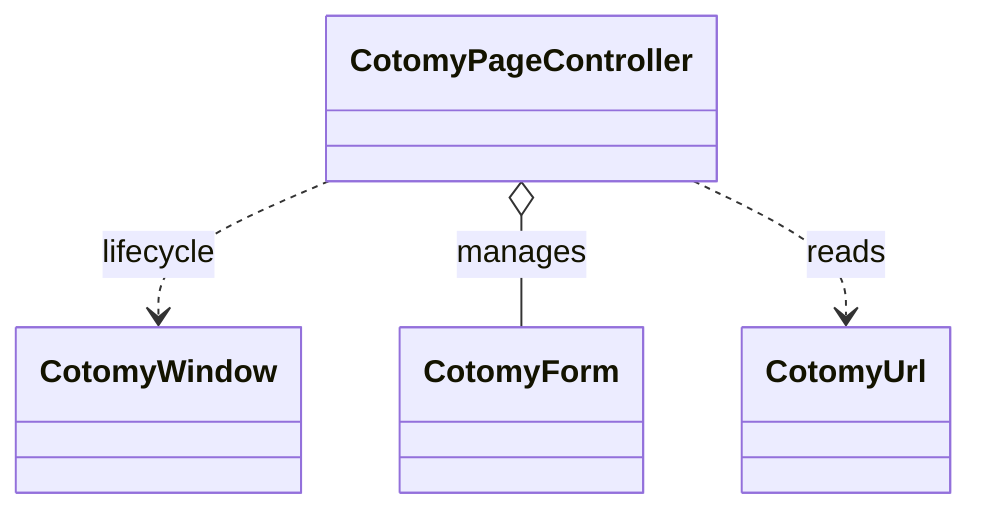

# Page Control

`CotomyPageController` coordinates page-level behavior.

It is the entry point layer for a page.

It manages:

- Page initialization
- Form registration
- Page restore after navigation
- URL handling

Cotomy keeps logic page-scoped. There is no global application state shared
across pages.  
The page controller coordinates behavior but does not replace element-level UI
logic.

The controller coordinates behavior but does not hold UI state.

## Goals

- Initialize page logic in one place
- Manage multiple forms
- Handle page lifecycle events

## Related Classes



## Why a Page Controller?

Cotomy is page-oriented. Each page is an independent UI module.
`CotomyPageController` provides a single place to:

- Initialize page-level logic
- Register forms
- Handle page lifecycle events

Without it, page logic becomes scattered across elements and scripts.

This is not a client-side router model. It targets document-driven business
screens where page scope keeps behavior predictable.

Think of the page controller as the orchestrator for a single screen.

## CotomyWindow in This Layer

`CotomyWindow` is the runtime surface that exposes page-level lifecycle events
to controllers. It handles:

- Initial load and ready timing
- Page restore detection (bfcache)
- Global page events used by forms and controllers

`CotomyPageController` runs on top of `CotomyWindow` to keep page logic
predictable without introducing a global app container.

## Page vs Form Responsibilities

| PageController | Form |
| --- | --- |
| Page initialization | Submit lifecycle |
| Form registration | API communication |
| Restore after navigation | Data load and rendering |
| URL access | Input and UI state |

## Steps

### 1) Create a page controller

```ts
import { CotomyPageController } from "cotomy";

CotomyPageController.set(class extends CotomyPageController {
	protected override async initializeAsync(): Promise<void> {
		console.log("Page initialized");
	}
});
```

`set()` should be called once per page entry. The controller initializes when
the page loads.

### 2) Register forms

```ts
import { CotomyEntityFillApiForm, CotomyPageController } from "cotomy";

CotomyPageController.set(class extends CotomyPageController {
	protected override async initializeAsync(): Promise<void> {
		this.setForm(CotomyEntityFillApiForm.byId<CotomyEntityFillApiForm>(
			"profile-form",
			class extends CotomyEntityFillApiForm {}
		)!);
	}
});
```

`setForm()` registers the form with the page controller. If the form element is
removed, it is automatically unregistered.  
`setForm()` also calls `initialize()` on the form.

### 3) Access registered forms

```ts
const form = this.getForm<CotomyEntityFillApiForm>("profile-form");
```

This is intended to be called inside a `CotomyPageController` subclass method
such as `initializeAsync()`.

### 4) Restore after page show

When a page is restored from browser cache (back/forward navigation), forms
with `autoReload` enabled reload their data.  
Restore runs only when the browser uses bfcache. This can vary by browser and
page settings, so it may not always fire.

### 5) URL handling

```ts
const url = this.url;
console.log(url.path);
console.log(url.parameters["id"]);
```

`CotomyUrl` is mainly for reading the current URL state. Use it to drive page
initialization, such as loading data by `id` from query parameters.

### 6) Lifecycle flow

Page load sequence:

1. `CotomyPageController.set()` is called
2. `CotomyWindow` initializes
3. `initializeAsync()` runs
4. Forms are registered
5. `cotomy:ready` fires

`initializeAsync()` runs once on page load. `restoreAsync()` runs when the page
is restored from browser history.

Restore logic affects registered forms, not arbitrary elements.

`cotomy:ready` is fired after page initialization completes and forms are
registered.

`CotomyPageController` works on top of `CotomyWindow`, which handles low-level
page events.

## Important Concept: One Controller per Page

Cotomy assumes one page controller per page entry. It keeps page logic isolated
and avoids cross-page state.

### CotomyPageController does not:

- Manage global application state
- Share data between pages automatically
- Implement client-side routing
- Persist data between pages
- Replace server-side navigation

## What just happened?

You created a page-level controller that:

- Initializes page logic
- Manages forms
- Handles lifecycle events

## Next

Next: [Debugging and Tips](./08-debugging-and-tips.md) to troubleshoot effectively.
