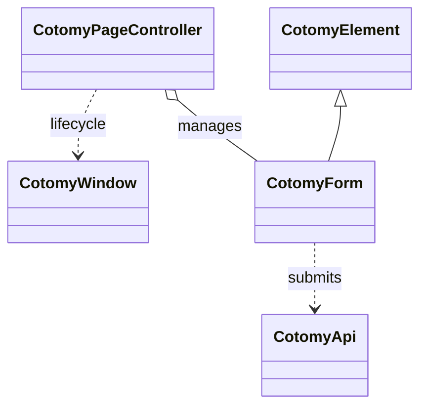

# Overview

Cotomy is a pragmatic UI runtime layer designed to make business web applications lighter, clearer, and safer to maintain.  
It provides a structured layer over the DOM, forms, and API communication — without introducing a heavy framework or hidden magic.

Cotomy favors **predictability over abstraction**, **HTML over virtual DOM**, and **explicit structure over convention-based behavior**.

Cotomy is designed for long-lived business systems where safe UI changes, predictable behavior, and low framework lock-in matter more than rendering tricks.

Cotomy reduces UI complexity by removing abstraction layers rather than adding them.

Cotomy does not manage application state. It manages runtime safety around the DOM.

This reference explains the building blocks that make that possible.

Cotomy is not trying to replace the browser platform. It is a runtime
discipline layer that makes browser-native UI safe for long-lived business
systems.

Download source code: [Cotomy v0.4.5 ZIP](https://github.com/yshr1920/cotomy/archive/refs/tags/v0.4.5.zip)

---

## Runtime Guarantees

Cotomy is not just a DOM helper. It enforces runtime-level safety rules that are normally left to developer discipline:

| Guarantee | What It Means in Practice |
|---|---|
| **Element identity tracking** | Each `CotomyElement` has a persistent instance ID used to manage lifecycle and events safely |
| **Automatic event cleanup** | Event handlers are centrally tracked and removed when elements leave the DOM |
| **Scoped CSS lifecycle** | Styles attached to elements are disposed when the last scoped element is removed |
| **DOM move awareness** | Internal transit events prevent state corruption during DOM reparenting |
| **DOM-state unification** | DOM state is the source of truth, reducing hidden state divergence |

These guarantees make UI behavior observable and predictable, not dependent on implicit framework rules.

`CotomyElement` makes it easy to bundle small bits of HTML and scoped CSS, then attach them to existing DOM nodes.
If you are getting started, read the [Getting Started](./getting-started.md) page first.
This example assumes a `header` already exists in the page.
For better template literal highlighting, we recommend a VS Code extension like `es6-string-html` for HTML/CSS.

```ts
CotomyElement.first("header")!.append(new CotomyElement({
  html: /* html */`<div class="message" data-kind="info">Ready to build.</div>`,
  css: /* css */`
    [root] {
      display: grid;
      gap: 6px;
      padding: 8px 12px;
      background: #f6f7f8;
      border: 1px solid #d9dee3;
      border-radius: 6px;
    }
  `
}));
```

---

## What is Cotomy?

Cotomy is **not** a full framework.  
It is a **structured UI runtime** for business UI that prioritizes maintainability, safe changes, and long-term stability.

It structures browser-native capabilities into a predictable UI execution model.

It adds structure to everyday tasks while staying close to HTML and the DOM:

- DOM manipulation with predictable helpers  
- Form and API handling with repeatable patterns  
- Scoped CSS that keeps changes localized  
- View-level behavior that stays explicit  

You can build interactive screens without a large SPA framework, and troubleshoot with standard browser tools.
It runs in the browser and works with plain JavaScript or TypeScript, with or without a build step.

---
## Architecture at a Glance

Cotomy is structured around four cooperating layers:



| Layer | Role |
| --- | --- |
| **CotomyElement** | DOM abstraction, scoped CSS engine, lifecycle tracking, event registry integration |
| **CotomyForm** | Structured form and API interaction model |
| **CotomyPageController** | Page-level behavior orchestration |
| **CotomyWindow** | App-wide lifecycle and navigation hooks |

This layered model replaces the need for a heavy SPA framework while keeping behavior predictable.

---

## What Problems It Solves

Cotomy addresses issues that make enterprise UI expensive to maintain:

- Changes ripple across screens due to shared CSS or hidden conventions  
- UI behavior becomes hard to trace when framework layers grow  
- Framework lock-in makes long-lived systems harder to evolve  
- Debugging slows down because DOM structure and UI state diverge  

Cotomy provides **just enough structure** to keep code organized while staying close to standard HTML and JavaScript.

---
## Lifecycle Safety

Cotomy automatically manages:

- Event listener cleanup when elements are removed  
- Scoped CSS disposal when components leave the DOM  
- Page re-entry handling for browser back and forward cache  

This prevents memory leaks and ghost event bugs common in large UI systems.

### Why This Matters

In many UI systems, developers must remember to:

- Manually remove event listeners  
- Avoid duplicate bindings  
- Clean up style tags  
- Handle browser back/forward cache edge cases  

Cotomy moves these concerns into the runtime layer so business UI code focuses on behavior, not lifecycle plumbing.

---

## Event Model

Cotomy centralizes event management per element instance.

- Events are registered through an internal registry  
- Duplicate handlers are prevented  
- Removal does not rely on fragile function references  
- One-time events are normalized  

This avoids common UI bugs such as duplicate listeners, memory leaks, and detached callbacks.

This allows large screens to grow without accumulating hidden listener bugs.

---

## DOM Transit Awareness

When elements move within the DOM tree, Cotomy emits internal transit events.

This ensures:

- Scoped CSS stays correct  
- State attributes remain valid  
- Moving elements does not trigger lifecycle bugs  

Few UI toolkits handle DOM relocation explicitly at runtime.

---
## Form as a First-Class Citizen

Forms in Cotomy are not simple HTML wrappers. They are structured units capable of:

- Query-based navigation  
- API-backed submission  
- Entity-aware PUT or POST switching  
- Automatic model binding and view filling  
- Automatic entity key handling based on server responses (POST → PUT transition)

This makes Cotomy particularly strong for business systems where forms and APIs drive most screens.

---
## Debugging Advantage

Cotomy avoids hidden rendering layers.

- No virtual DOM  
- No component re-render cycle  
- DOM state is the actual UI state  

Standard browser tools are usually enough for troubleshooting.

## State Model

Cotomy treats the DOM as the source of truth:

- No hidden component state store  
- No render cycle abstraction  
- Form fields, attributes, and DOM position represent UI state directly  

This reduces desynchronization bugs common in SPA-style architectures.

---
## Design Philosophy

Cotomy is built on the following principles:

- **Low lock-in**  
  Adds order without replacing the platform.

- **HTML-first**  
  Markup remains the primary source of truth.

- **Scoped styling**  
  Changes stay local and do not leak into other screens.

- **Explicit over magic**  
  Behavior is defined clearly, so troubleshooting stays simple.

- **Small surface area**  
  Only essential abstractions are introduced.

- **Predictable behavior**  
  Utilities behave consistently across screens.

- **Runtime over compile-time tricks**  
  Behavior is controlled in the browser at runtime, not through build-time transforms.

---

## When to Use Cotomy

Cotomy is well-suited for:

- Business applications  
- Form-driven interfaces  
- Admin and management screens  
- Server-rendered pages with dynamic behavior  

---

## When Not to Use Cotomy

Cotomy is not intended for:

- Large-scale SPA state management  
- Virtual DOM–driven UI systems  
- Graphics-heavy or canvas-based apps  

---

## Cross-Reference: Comparison with Major Frameworks

Below is a compact, cross-reference friendly summary derived from `docs/comparison.md`.
Use it as a quick decision guide, then see the Comparison page in the HP reference for full details.

| Framework | State Management | SSR | DX | Learning Cost | Cotomy vs |
|---|---|---|---|---|---|
| Cotomy | DOM-first, `data-*` binding, no dedicated store | None | Light, incremental adoption | Low–Medium | Form-centric, DOM-first runtime, minimal abstraction |
| React | `useState`/`useReducer`, external stores common | Strong via Next.js | Large ecosystem | Medium–High | Flexible and scalable, but heavier |
| Vue | `reactive`/`ref`, Pinia | Mature via Nuxt | Component templates, approachable | Medium | Declarative UI focus vs DOM-first |
| Svelte | Compiler-driven reactivity, stores | SvelteKit | Lean runtime | Medium | Build-time optimization vs runtime DOM |
| Angular | RxJS, NgRx, DI-heavy | Angular Universal | Enterprise tooling | High | Large-scale standardization vs lightweight |
| Alpine | `x-data`-style lightweight state | None | Very simple | Low | Similar DOM-first, thinner on forms/API |

---
## Where Cotomy Sits in the Stack

Cotomy is best understood as a **UI runtime layer** that sits between:

Server-rendered HTML  
⬇  
Cotomy runtime (structure, lifecycle, forms, events)  
⬇  
Business-specific UI logic

It does not replace the platform — it structures it.

## How to Use This Reference

Use the sidebar to navigate to each class, interface, and utility.  
Each page describes its purpose, methods, and expected behavior.
