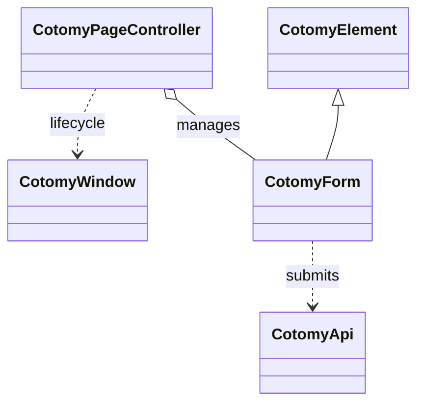

# Overview

Cotomy is a runtime layer for business UI. It keeps the browser as the center of the system, while adding structure around DOM updates, forms, and API calls.

The goal is simple: make long-lived screens easier to change and debug without committing to a heavy SPA stack.

Cotomy does not add a separate app state store. UI state stays in the DOM, and business state stays in your application logic.

This reference explains the core pieces behind that model.

Key references: [CotomyElement](/reference/classes/view/cotomy-element/), [CotomyApiForm](/reference/classes/forms/cotomy-api-form/), [CotomyWindow](/reference/classes/view/cotomy-window/), and the full [Class Index](/reference/).
For design notes and practical write-ups, visit the [Cotomy Blog](https://blog.cotomy.net/).

## Release Notes

### v1.0.5 (2025-08-31 13:30 UTC)

Downloads: [ZIP](https://github.com/yshr1920/cotomy/archive/refs/tags/v1.0.5.zip) | [TAR.GZ](https://github.com/yshr1920/cotomy/archive/refs/tags/v1.0.5.tar.gz)

- Simplified `convertUtcToLocal()` format-attribute handling, changed `data-cotomy-format` to read only from the current element, and kept ancestor lookup for `data-cotomy-timezone` to support global timezone settings.

### v1.0.4 (2026-02-21 06:45 UTC)

Downloads: [ZIP](https://github.com/yshr1920/cotomy/archive/refs/tags/v1.0.4.zip) | [TAR.GZ](https://github.com/yshr1920/cotomy/archive/refs/tags/v1.0.4.tar.gz)

- Added page-level default bind-name-generator support for `CotomyEntityFillApiForm` and `CotomyViewRenderer`.

### v1.0.3 (2026-02-20 15:38 UTC)

Downloads: [ZIP](https://github.com/yshr1920/cotomy/archive/refs/tags/v1.0.3.zip) | [TAR.GZ](https://github.com/yshr1920/cotomy/archive/refs/tags/v1.0.3.tar.gz)

- Restored attached-state semantics and added `isConnected` handling.

### v1.0.2 (2026-02-20 13:25 UTC)

Downloads: [ZIP](https://github.com/yshr1920/cotomy/archive/refs/tags/v1.0.2.zip) | [TAR.GZ](https://github.com/yshr1920/cotomy/archive/refs/tags/v1.0.2.tar.gz)

- Updated attached-state detection to use `Node.isConnected`.
- Expanded and refined reference-site docs (overview/release notes, class index, navigation, SEO, and policy pages).

### v1.0.1 (2026-02-09 13:04 UTC)

Downloads: [ZIP](https://github.com/yshr1920/cotomy/archive/refs/tags/v1.0.1.zip) | [TAR.GZ](https://github.com/yshr1920/cotomy/archive/refs/tags/v1.0.1.tar.gz)

- Fixed keepalive option handling.
- Updated reference-site docs and build configuration (TypeScript 5.8.x, sitemap, overview/comparison, and support info).

### v1.0.0 (2026-02-07 15:30 UTC)

Downloads: [ZIP](https://github.com/yshr1920/cotomy/archive/refs/tags/v1.0.0.zip) | [TAR.GZ](https://github.com/yshr1920/cotomy/archive/refs/tags/v1.0.0.tar.gz)

- Released 1.0.0.
- Updated README and reference URL guidance for the stable line.

---

## Runtime Guarantees

Cotomy includes runtime guardrails that are often left to manual discipline:

| Guarantee | What It Means in Practice |
|---|---|
| **Element identity tracking** | Each CotomyElement has a persistent instance ID used to manage lifecycle and events safely |
| **Automatic event cleanup** | Handlers registered via on/onSubTree/once are tracked and removed when elements leave the DOM |
| **Scoped CSS lifecycle** | Styles attached to elements are disposed when the last scoped element is removed |
| **DOM move awareness** | Internal transit events prevent state corruption during DOM reparenting |
| **DOM-state unification** | DOM state is the source of truth, reducing hidden state divergence |

These guarantees reduce common long-term UI failures such as memory leaks, orphaned handlers, and style leakage.

CotomyElement makes it easy to bundle small bits of HTML and scoped CSS, then attach them to existing DOM nodes.
If you are getting started, read the [Getting Started](./getting-started.md) page first.
This example assumes a header already exists in the page.
For better template literal highlighting, we recommend a VS Code extension like es6-string-html for HTML/CSS.

```ts
CotomyElement.first("header")!.append(new CotomyElement({
  html: /* html */`<div class="message" data-kind="info">Ready to build.</div>`,
  css: /* css */`
    [root] {
      display: grid;
      gap: 6px;
      padding: 8px 12px;
      background: #f6f7f8;
      border: 1px solid #d9dee3;
      border-radius: 6px;
    }
  `
}));
```

---

## What is Cotomy?

Cotomy is a structured UI runtime, not a component-rendering SPA framework.
It keeps day-to-day UI work close to HTML and the DOM:

- DOM manipulation with predictable helpers  
- Form and API handling with repeatable patterns  
- Scoped CSS that keeps changes localized  
- View-level behavior that stays explicit  

You can build interactive screens without a large SPA framework, and troubleshoot with standard browser tools.
It runs in the browser and works with plain JavaScript or TypeScript, with or without a build step.

---
## Architecture at a Glance

Cotomy is structured around four cooperating layers:


```mermaid
classDiagram
class CotomyWindow
class CotomyPageController
class CotomyElement
class CotomyForm
class CotomyApi

CotomyElement <|-- CotomyForm
CotomyForm ..> CotomyApi : submits
CotomyPageController o-- CotomyForm : manages
CotomyPageController ..> CotomyWindow : lifecycle
```

| Layer | Role |
| --- | --- |
| **CotomyElement** | DOM abstraction, scoped CSS engine, lifecycle tracking, event registry integration |
| **CotomyForm** | Structured form and API interaction model |
| **CotomyPageController** | Page-level behavior orchestration |
| **CotomyWindow** | App-wide lifecycle and navigation hooks |

This layered model keeps behavior explicit without introducing a large framework runtime.

---

## What Problems It Solves

Cotomy focuses on the issues that usually make business UI expensive to maintain:

- Changes ripple across screens due to shared CSS or hidden conventions  
- UI behavior becomes hard to trace when framework layers grow  
- Framework lock-in makes long-lived systems harder to evolve  
- Debugging slows down because DOM structure and UI state diverge  

It provides enough structure to keep code organized while staying close to standard HTML and JavaScript.

---
## Lifecycle Safety

Cotomy automatically manages:

- Cleanup for on/onSubTree/once handlers when elements are removed  
- Scoped CSS disposal when components leave the DOM  
- Page re-entry handling for browser back and forward cache  

This prevents memory leaks and ghost event bugs common in large UI systems.

### Why This Matters

In many projects, developers still need to remember to:

- Manually remove event listeners  
- Avoid duplicate bindings  
- Clean up style tags  
- Handle browser back/forward cache edge cases  

Cotomy moves these concerns into the runtime layer so business UI code focuses on behavior, not lifecycle plumbing.

---

## Event Model

Cotomy centralizes event management per element instance:

- Events are registered through an internal registry  
- Duplicate handlers are prevented  
- Removal does not rely on fragile function references  
- One-time events are normalized  

This avoids common UI bugs such as duplicate listeners, memory leaks, and detached callbacks.

Shortcut helpers like click() use native listeners and are not tracked in the registry.

This helps large screens grow without quietly accumulating listener bugs.

---

## DOM Transit Awareness

When elements move within the DOM tree, Cotomy emits internal transit events.

This ensures:

- Scoped CSS stays correct  
- State attributes remain valid  
- Moving elements does not trigger lifecycle bugs  

Few UI toolkits handle DOM relocation explicitly at runtime.

---
## Form as a First-Class Citizen

In Cotomy, forms are treated as structured runtime units:

- Query-based navigation  
- API-backed submission  
- Entity-aware PUT or POST switching  
- Automatic model binding and view filling  
- Automatic entity key handling based on server responses (POST → PUT transition)

This is particularly useful for systems where most screens are form and API driven.

---
## Debugging Advantage

Cotomy avoids hidden rendering layers.

- No virtual DOM  
- No component re-render cycle  
- DOM state is the actual UI state  

Standard browser tools are usually enough for troubleshooting.

## State Model

Cotomy treats the DOM as the source of truth:

- No hidden component state store  
- No render cycle abstraction  
- Form fields, attributes, and DOM position represent UI state directly  

This reduces desynchronization bugs common in SPA-style architectures.

---
## Design Philosophy

Cotomy follows these principles:

- **Low lock-in**  
  Add structure without replacing the platform.

- **HTML-first**  
  Keep markup as the primary source of truth.

- **Scoped styling**  
  Keep changes local to the relevant screen.

- **Explicit over magic**  
  Favor behavior you can trace directly.

- **Small surface area**  
  Introduce only essential abstractions.

- **Predictable behavior**  
  Keep utility behavior consistent.

- **Runtime over compile-time tricks**  
  Prefer runtime behavior over build-time transforms.

---

## When to Use Cotomy

Cotomy is a good fit for:

- Business applications  
- Form-driven interfaces  
- Admin and management screens  
- Server-rendered pages with dynamic behavior  

---

## When Not to Use Cotomy

Cotomy is not the best fit for:

- Large-scale SPA state management  
- Virtual DOM–driven UI systems  
- Graphics-heavy or canvas-based apps  

---

## Cross-Reference: Comparison with Major Frameworks

Use this as a quick comparison guide.

| Framework | State Management | SSR | DX | Learning Cost | Cotomy vs |
|---|---|---|---|---|---|
| Cotomy | DOM-first, data-* binding, no dedicated store | None | Light, incremental adoption | Low–Medium | Form-centric, DOM-first runtime, minimal abstraction |
| React | useState/useReducer, external stores common | Strong via Next.js | Large ecosystem | Medium–High | Flexible and scalable, but heavier |
| Vue | reactive/ref, Pinia | Mature via Nuxt | Component templates, approachable | Medium | Declarative UI focus vs DOM-first |
| Svelte | Compiler-driven reactivity, stores | SvelteKit | Lean runtime | Medium | Build-time optimization vs runtime DOM |
| Angular | RxJS, NgRx, DI-heavy | Angular Universal | Enterprise tooling | High | Large-scale standardization vs lightweight |
| Alpine | x-data-style lightweight state | None | Very simple | Low | Similar DOM-first, thinner on forms/API |

---
## Where Cotomy Sits in the Stack

Cotomy sits between server-rendered HTML and business-specific UI logic:

Server-rendered HTML  
⬇  
Cotomy runtime (structure, lifecycle, forms, events)  
⬇  
Business-specific UI logic

It does not replace the platform; it structures it.

---
## Contact

Email: yshr1920@gmail.com

## How to Use This Reference

Use the sidebar to navigate to each class, interface, and utility.  
Each page describes purpose, methods, and expected behavior.

## Practical Guides

For real-world usage and architectural discussions:

- [Problem #5 - Business Operations Need a Protocol](https://blog.cotomy.net/posts/problem-5-api-driven-entities-ui-contract-stability/)
- [Problem #6 - Runtime Boundaries and Operational Safety](https://blog.cotomy.net/posts/problem-6-runtime-boundaries-operational-safety/)
